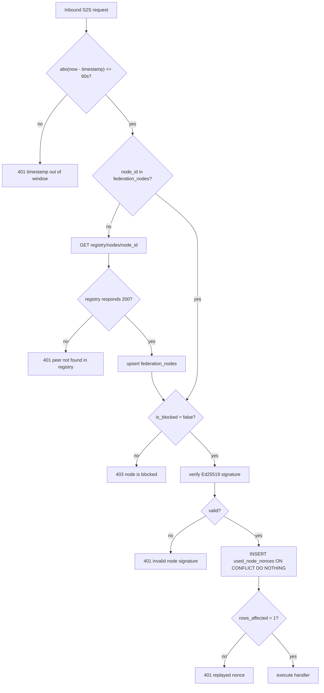
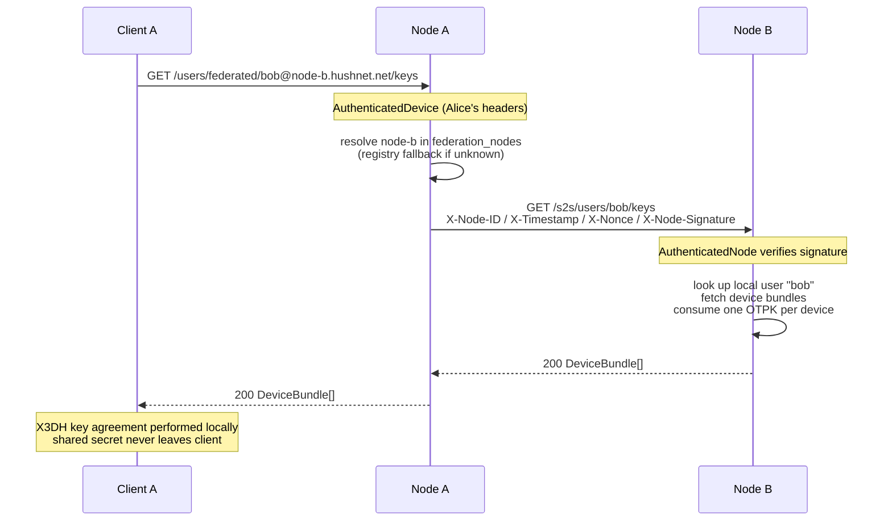
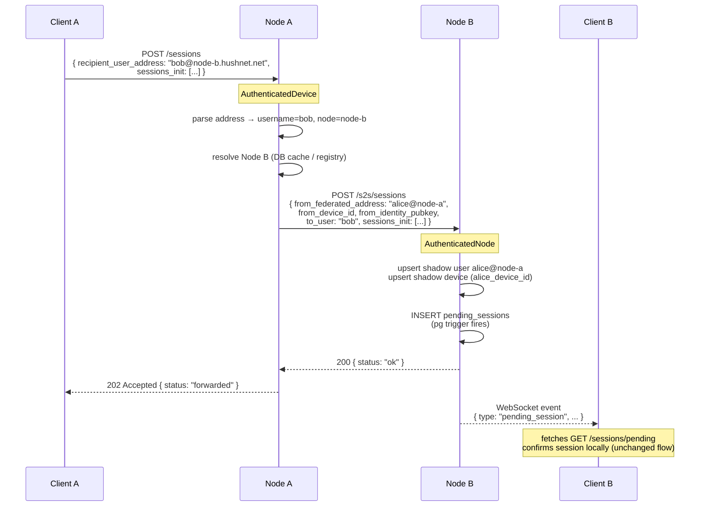
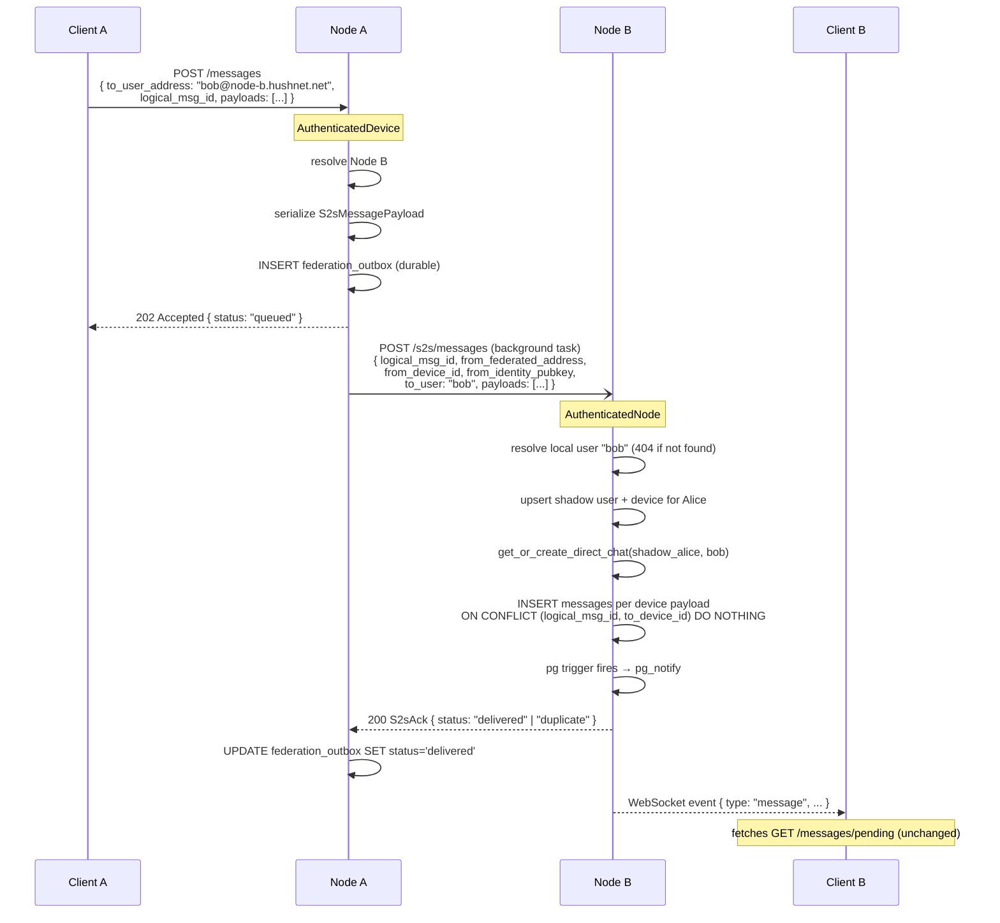

# 🌐 API Reference

Complete API documentation for HushNet Backend.

---

## Table of Contents

- [Authentication](#authentication)
- [Root Endpoints](#root-endpoints)
- [User Endpoints](#user-endpoints)
- [Device Endpoints](#device-endpoints)
- [Session Endpoints](#session-endpoints)
- [Chat Endpoints](#chat-endpoints)
- [Message Endpoints](#message-endpoints)
- [WebSocket Endpoints](#websocket-endpoints)
- [Federation — Inter-Node Messaging](#federation--inter-node-messaging)
- [Error Responses](#error-responses)

---

## Authentication

HushNet uses **Ed25519 signature-based authentication** instead of JWT. Each authenticated request must include the following headers:

### Required Headers

| Header | Description | Format |
|--------|-------------|--------|
| `X-Identity-Key` | Base64-encoded Ed25519 public key (32 bytes) | `base64(public_key)` |
| `X-Signature` | Base64-encoded signature (64 bytes) | `base64(signature)` |
| `X-Timestamp` | Unix timestamp (seconds) | `1698765432` |

### Authentication Flow

1. **Client** generates a current Unix timestamp
2. **Client** signs the timestamp with their Ed25519 private key
3. **Client** sends request with headers:
   - `X-Identity-Key`: Device's identity public key
   - `X-Signature`: Signature of the timestamp
   - `X-Timestamp`: The timestamp that was signed
4. **Server** verifies:
   - Timestamp is within 30 seconds window (anti-replay)
   - Signature is valid for the given public key
   - Device exists with that identity key

### Example (JavaScript)

```javascript
import { sign } from '@noble/ed25519';

const timestamp = Math.floor(Date.now() / 1000).toString();
const signature = await sign(
  new TextEncoder().encode(timestamp),
  privateKey
);

const headers = {
  'X-Identity-Key': base64Encode(publicKey),
  'X-Signature': base64Encode(signature),
  'X-Timestamp': timestamp,
  'Content-Type': 'application/json'
};
```

### Authentication Errors

| Status | Error | Description |
|--------|-------|-------------|
| `401` | Missing X-Identity-Key | Header not provided |
| `401` | Missing X-Signature | Header not provided |
| `401` | Missing X-Timestamp | Header not provided |
| `401` | Expired timestamp | Timestamp outside 30s window |
| `401` | Signature mismatch | Invalid signature |
| `401` | Unknown device | Device not registered |
| `400` | Bad signature b64 | Invalid base64 encoding |
| `400` | Signature must be 64 bytes | Wrong signature length |
| `400` | Bad pubkey b64 | Invalid base64 encoding |
| `400` | Bad pubkey length | Public key not 32 bytes |
| `400` | Bad pubkey | Invalid Ed25519 public key |

---

## Root Endpoints

### GET `/`

Health check endpoint.

**Authentication**: Not required

**Response**: `200 OK`

```json
{
  "message": "Hello from HushNet Backend",
  "version": "0.1.0",
  "status": "healthy"
}
```

---

## User Endpoints

### GET `/users`

List all users.

**Authentication**: Not required

**Response**: `200 OK`

```json
[
  {
    "id": "f47ac10b-58cc-4372-a567-0e02b2c3d479",
    "username": "alice",
    "created_at": "2025-11-02T10:30:00Z"
  },
  {
    "id": "a1b2c3d4-e5f6-7890-abcd-ef1234567890",
    "username": "bob",
    "created_at": "2025-11-02T11:00:00Z"
  }
]
```

---

### POST `/users`

Create a new user.

**Authentication**: Not required

**Request Body**:

```json
{
  "username": "alice"
}
```

**Response**: `201 Created`

```json
{
  "id": "f47ac10b-58cc-4372-a567-0e02b2c3d479",
  "username": "alice",
  "created_at": "2025-11-02T10:30:00Z"
}
```

**Errors**:

- `400 Bad Request`: Invalid username
- `409 Conflict`: Username already exists

---

### GET `/users/:id`

Get user by ID.

**Authentication**: Required

**Parameters**:

- `id` (UUID): User ID

**Response**: `200 OK`

```json
{
  "id": "f47ac10b-58cc-4372-a567-0e02b2c3d479",
  "username": "alice",
  "created_at": "2025-11-02T10:30:00Z"
}
```

**Errors**:

- `401 Unauthorized`: Invalid authentication
- `404 Not Found`: User does not exist

---

### POST `/login`

Authenticate a user (returns user info for verification).

**Authentication**: Not required

**Request Body**:

```json
{
  "username": "alice",
  "identity_pubkey": "base64_encoded_public_key"
}
```

**Response**: `200 OK`

```json
{
  "user_id": "f47ac10b-58cc-4372-a567-0e02b2c3d479",
  "device_id": "d1e2f3a4-b5c6-7890-abcd-ef1234567890",
  "username": "alice"
}
```

**Errors**:

- `401 Unauthorized`: Invalid credentials
- `404 Not Found`: User or device not found

---

## Device Endpoints

### GET `/devices/:user_id`

List all devices for a user.

**Authentication**: Required

**Parameters**:

- `user_id` (UUID): User ID

**Response**: `200 OK`

```json
[
  {
    "id": "d1e2f3a4-b5c6-7890-abcd-ef1234567890",
    "user_id": "f47ac10b-58cc-4372-a567-0e02b2c3d479",
    "identity_pubkey": "base64_encoded_key",
    "prekey_pubkey": "base64_encoded_key",
    "signed_prekey_pub": "base64_encoded_key",
    "signed_prekey_sig": "base64_encoded_sig",
    "one_time_prekeys": ["key1", "key2", "key3"],
    "device_label": "iPhone 15 Pro",
    "push_token": "apns_token_here",
    "last_seen": "2025-11-02T14:30:00Z",
    "created_at": "2025-11-02T10:30:00Z"
  }
]
```

---

### POST `/devices`

Register a new device.

**Authentication**: Required

**Request Body**:

```json
{
  "user_id": "f47ac10b-58cc-4372-a567-0e02b2c3d479",
  "identity_pubkey": "base64_encoded_identity_key",
  "prekey_pubkey": "base64_encoded_prekey",
  "signed_prekey_pub": "base64_encoded_signed_prekey_pub",
  "signed_prekey_sig": "base64_encoded_signed_prekey_signature",
  "one_time_prekeys": [
    "base64_encoded_otpk_1",
    "base64_encoded_otpk_2",
    "base64_encoded_otpk_3"
  ],
  "device_label": "iPhone 15 Pro",
  "push_token": "apns_or_fcm_token"
}
```

**Response**: `201 Created`

```json
{
  "id": "d1e2f3a4-b5c6-7890-abcd-ef1234567890",
  "user_id": "f47ac10b-58cc-4372-a567-0e02b2c3d479",
  "identity_pubkey": "base64_encoded_identity_key",
  "device_label": "iPhone 15 Pro",
  "created_at": "2025-11-02T10:30:00Z"
}
```

**Errors**:

- `400 Bad Request`: Invalid device data
- `401 Unauthorized`: Invalid authentication
- `409 Conflict`: Device already exists

---

### GET `/devices/keys/:username`

Get public keys for all devices of a user (for key exchange).

**Authentication**: Required

**Parameters**:

- `username` (string): Username

**Response**: `200 OK`

```json
{
  "user_id": "f47ac10b-58cc-4372-a567-0e02b2c3d479",
  "username": "alice",
  "devices": [
    {
      "device_id": "d1e2f3a4-b5c6-7890-abcd-ef1234567890",
      "identity_pubkey": "base64_encoded_key",
      "signed_prekey_pub": "base64_encoded_key",
      "signed_prekey_sig": "base64_encoded_sig",
      "one_time_prekey": "base64_encoded_otpk"
    }
  ]
}
```

**Note**: One-time prekeys are consumed after retrieval.

---

## Session Endpoints

### POST `/sessions`

Initiate an X3DH session with another device.

**Authentication**: Required

**Request Body**:

```json
{
  "sender_device_id": "your_device_uuid",
  "recipient_device_id": "recipient_device_uuid",
  "ephemeral_pubkey": "base64_encoded_ephemeral_key",
  "sender_prekey_pub": "base64_encoded_sender_prekey",
  "otpk_used": "base64_encoded_one_time_prekey_used",
  "ciphertext": "base64_encoded_initial_message"
}
```

**Response**: `201 Created`

```json
{
  "session_id": "session-uuid",
  "status": "pending",
  "created_at": "2025-11-02T10:30:00Z"
}
```

---

### GET `/sessions/pending`

Get pending session requests for the authenticated device.

**Authentication**: Required

**Query Parameters**:

- `device_id` (UUID): Device ID

**Response**: `200 OK`

```json
[
  {
    "id": "session-uuid",
    "sender_device_id": "sender-device-uuid",
    "recipient_device_id": "your-device-uuid",
    "ephemeral_pubkey": "base64_encoded_key",
    "sender_prekey_pub": "base64_encoded_key",
    "otpk_used": "base64_encoded_key",
    "ciphertext": "base64_encoded_message",
    "state": "initiated",
    "created_at": "2025-11-02T10:30:00Z"
  }
]
```

---

### POST `/sessions/confirm`

Confirm and complete a session.

**Authentication**: Required

**Request Body**:

```json
{
  "pending_session_id": "session-uuid",
  "chat_id": "chat-uuid"
}
```

**Response**: `200 OK`

```json
{
  "session_id": "confirmed-session-uuid",
  "status": "completed",
  "chat_id": "chat-uuid"
}
```

---

## Chat Endpoints

### GET `/chats`

Get all chats for the authenticated user.

**Authentication**: Required

**Query Parameters**:

- `user_id` (UUID): User ID

**Response**: `200 OK`

```json
[
  {
    "id": "chat-uuid",
    "chat_type": "direct",
    "user_a": "user-uuid-1",
    "user_b": "user-uuid-2",
    "name": null,
    "last_message_id": "message-uuid",
    "created_at": "2025-11-02T10:00:00Z",
    "updated_at": "2025-11-02T14:30:00Z"
  },
  {
    "id": "chat-uuid-2",
    "chat_type": "group",
    "name": "Project Team",
    "owner_id": "user-uuid-1",
    "last_message_id": "message-uuid-2",
    "created_at": "2025-11-01T09:00:00Z",
    "updated_at": "2025-11-02T15:00:00Z"
  }
]
```

---

### GET `/chats/:chat_id/devices`

Get all device IDs participating in a chat.

**Authentication**: Required

**Parameters**:

- `chat_id` (UUID): Chat ID

**Response**: `200 OK`

```json
{
  "chat_id": "chat-uuid",
  "devices": [
    "device-uuid-1",
    "device-uuid-2",
    "device-uuid-3"
  ]
}
```

---

## Message Endpoints

### POST `/messages`

Send an encrypted message.

**Authentication**: Required

**Request Body**:

```json
{
  "chat_id": "chat-uuid",
  "to_device_id": "recipient-device-uuid",
  "header": {
    "dh_pubkey": "base64_encoded_ratchet_key",
    "pn": 0,
    "n": 1
  },
  "ciphertext": "base64_encoded_encrypted_content"
}
```

**Response**: `201 Created`

```json
{
  "message_id": "message-uuid",
  "logical_msg_id": "logical-uuid",
  "created_at": "2025-11-02T14:30:00Z"
}
```

---

### GET `/messages/pending/:device_id`

Get pending messages for a device.

**Authentication**: Required

**Parameters**:

- `device_id` (UUID): Device ID

**Response**: `200 OK`

```json
[
  {
    "id": "message-uuid",
    "logical_msg_id": "logical-uuid",
    "chat_id": "chat-uuid",
    "from_user_id": "sender-user-uuid",
    "from_device_id": "sender-device-uuid",
    "to_user_id": "your-user-uuid",
    "to_device_id": "your-device-uuid",
    "header": {
      "dh_pubkey": "base64_key",
      "pn": 0,
      "n": 1
    },
    "ciphertext": "base64_encrypted_content",
    "delivered_at": null,
    "read_at": null,
    "created_at": "2025-11-02T14:30:00Z"
  }
]
```

---

## WebSocket Endpoints

### WS `/ws?user_id=<uuid>`

Establish a WebSocket connection for real-time events.

**Authentication**: Query parameter `user_id` required

**Connection**:

```javascript
const ws = new WebSocket('ws://127.0.0.1:8080/ws?user_id=<user-uuid>');
```

### Event Types

#### 1. New Message

```json
{
  "type": "message",
  "chat_id": "chat-uuid",
  "user_id": "recipient-user-uuid"
}
```

**Action**: Fetch pending messages for the chat.

#### 2. New Session

```json
{
  "type": "session",
  "user_id": "affected-user-uuid",
  "sender_device_id": "sender-device-uuid",
  "receiver_device_id": "receiver-device-uuid"
}
```

**Action**: Fetch pending sessions.

#### 3. Device Update

```json
{
  "type": "device",
  "user_id": "user-uuid"
}
```

**Action**: Refresh device list for the user.

---

---

## Federation — Inter-Node Messaging

Federation allows users registered on different HushNet nodes to exchange messages. The cryptographic layer (X3DH, Double Ratchet) is unchanged — clients remain responsible for all key agreement and encryption. Servers route opaque ciphertexts; no node can read message content.

---

### Architecture Overview

```
┌───────────────────────────────────────────────────────────────────────┐
│                         HushNet Network                               │
│                                                                       │
│   ┌──────────────────┐          S2S (Ed25519)      ┌───────────────┐ │
│   │     Node A        │◄────────────────────────────►    Node B    │ │
│   │                   │                              │              │ │
│   │  Alice (local)    │                              │  Bob (local) │ │
│   │  Bob   (shadow)◄──┼──────────────────────────────┼─────────────┘ │
│   └──────────────────┘                              └───────────────┘ │
│           ▲                                                  ▲        │
│           │ client API                           client API │        │
│           │                                                  │        │
│       Client A                                           Client B     │
└───────────────────────────────────────────────────────────────────────┘
```

**Invariants:**
- Clients always talk to their home node only.
- Nodes forward already-encrypted payloads. No node sees plaintext.
- Private keys never leave the client device.
- Double Ratchet session state never touches a server.

---

### Federated User Addressing

A federated address uniquely identifies a user across all nodes:

```
alice@node-a.hushnet.net
bob@node-b.hushnet.net
```

Format: `{username}@{node_host}`

The node host is the `NODE_HOST` environment variable set at startup. It is registered at the central registry (`registry.hushnet.net`) alongside the node's Ed25519 public key and API base URL.

**Routing rule (applied server-side on every relevant request):**
- If `node_host == this node` → local delivery (existing path, unchanged).
- If `node_host != this node` → federated path (S2S forwarding).

---

### Node-to-Node Authentication (S2S)

Every outbound S2S request from Node A carries four headers. Node B verifies them in sequence before executing the handler.

| Header | Value |
|--------|-------|
| `X-Node-ID` | Sender's canonical node identifier (`node-a.hushnet.net`) |
| `X-Timestamp` | Unix seconds as a decimal string |
| `X-Nonce` | 16 random bytes, base64-encoded |
| `X-Node-Signature` | Ed25519 signature, base64-encoded |

**Canonical string signed (fields joined by `\n`, UTF-8):**

```
{HTTP_METHOD}\n{path}\n{timestamp}\n{nonce}
```

Only the path portion of the URL is signed (no scheme, no host), so the canonical string is stable regardless of which domain name the caller used.

**Verification sequence on Node B:**



**Public key discovery:** On first contact from an unknown peer, Node B fetches `GET {registry_url}/api/registry/nodes/{node_id}` and caches the result in `federation_nodes`. Subsequent requests use the cache (no registry call).

**Anti-replay:** The `(node_id, nonce)` pair is stored in `used_node_nonces` immediately after signature verification. Nonces are unique per request; the 60-second timestamp window bounds how long they need to be retained. The outbox worker purges entries older than 5 minutes.

---

### Flow 1 — Federated Prekey Lookup

Before initiating X3DH with a remote user, Client A must obtain Bob's prekey bundle from Node B. Node A acts as a transparent proxy; it does not cache the bundle because OTPKs are one-time-use.



---

### Flow 2 — Cross-Node X3DH Session Initiation

Client A performs X3DH locally using Bob's prekeys, then sends the encrypted init envelope to Node A. Node A forwards it to Node B synchronously (no outbox — session inits are small and need to be prompt).



---

### Flow 3 — Cross-Node Message Delivery

Client A sends an already-encrypted message to Node A. Node A writes to the outbox for durability, then immediately attempts delivery to Node B in a background task. The client receives 202 Accepted before the S2S call completes.



**Outbox retry schedule:**

| Attempt | Delay before next retry |
|---------|------------------------|
| 1 | 10 s |
| 2 | 20 s |
| 3 | 40 s |
| 4 | 80 s |
| 5 | 160 s |
| 6 | 320 s |
| 7 | 640 s |
| 8 | 1 280 s |
| 9 | 2 560 s |
| 10 | — (marked `failed`) |

---

### Shadow Records

When Node B receives a message from `alice@node-a`, it needs valid rows in `users` and `devices` to satisfy the foreign-key constraints on the `messages` table. Two shadow records are upserted automatically:

**Shadow user** (`users.home_node_id IS NOT NULL`):
- `username` = `"alice"` (local part of the federated address)
- `federated_address` = `"alice@node-a.hushnet.net"` (unique key for upsert)
- `home_node_id` → FK to `federation_nodes`

**Shadow device** (`devices` with empty prekey fields):
- `id` = device UUID from Node A (reused; UUID collision probability negligible)
- `identity_pubkey` = Alice's Ed25519 IK (included in every S2S payload)
- `prekey_pubkey`, `signed_prekey_pub`, `signed_prekey_sig` = `""` (never queried)
- `one_time_prekeys` = `[]` (never queried)

Shadow records are never returned by client-facing endpoints (`GET /users`, `GET /users/:id/keys`, etc.) because those queries filter `WHERE home_node_id IS NULL`.

---

### New Client-Facing Endpoint

#### GET `/users/federated/{address}/keys`

Fetch the prekey bundle for a remote user. Node A proxies the request to the user's home node.

**Authentication:** Required (standard `AuthenticatedDevice` headers)

**Path parameter:**

| Name | Type | Description |
|------|------|-------------|
| `address` | string | Full federated address: `bob@node-b.hushnet.net` |

**Response:** `200 OK` — same structure as local `GET /users/:id/keys`

```json
[
  {
    "device_id": "d1e2f3a4-b5c6-7890-abcd-ef1234567890",
    "identity_pubkey": "base64...",
    "signed_prekey_pub": "base64...",
    "signed_prekey_sig": "base64...",
    "one_time_prekeys": ["base64_otpk_1"]
  }
]
```

**Errors:**

| Status | Condition |
|--------|-----------|
| `400` | Address missing `@` separator |
| `403` | Target node is blocked |
| `404` | Remote user not found on target node |
| `502` | Target node returned an error |
| `503` | Registry unreachable and node unknown |

---

### Extended Client Endpoints

Two existing endpoints accept an additional optional field for cross-node delivery. Clients that do not send the new field continue to work without modification.

#### POST `/messages` — new optional field

```json
{
  "chat_id": "uuid",
  "logical_msg_id": "string",
  "to_user_id": "uuid",
  "to_user_address": "bob@node-b.hushnet.net",
  "payloads": [
    {
      "to_device_id": "uuid",
      "header": { "...": "..." },
      "ciphertext": "base64..."
    }
  ]
}
```

When `to_user_address` is present and its node portion differs from this node's `NODE_HOST`, the message is forwarded via S2S. `to_user_id` is still required for schema compatibility but is ignored in the federated path.

**Response when federated:** `202 Accepted`
```json
{ "status": "queued" }
```

#### POST `/sessions` — new optional field

```json
{
  "recipient_user_id": "uuid",
  "recipient_user_address": "bob@node-b.hushnet.net",
  "sessions_init": [ { "...": "..." } ]
}
```

**Response when federated:** `202 Accepted`
```json
{ "status": "forwarded" }
```

---

### S2S Endpoints (Node-to-Node Only)

These endpoints are consumed exclusively by peer nodes. Client applications must never call them directly.

#### GET `/s2s/info`

Return this node's public identity. No authentication required — this is the bootstrap endpoint that lets an unknown peer fetch the public key before the registry has been consulted.

**Response:** `200 OK`

```json
{
  "node_id": "node-a.hushnet.net",
  "api_url": "https://node-a.hushnet.net/api",
  "public_key_b64": "base64_ed25519_verifying_key",
  "protocol_version": "0.0.1"
}
```

> **Security note:** The returned key should be cross-checked against the central registry before being trusted. A MITM that intercepts this call could substitute their own key if the channel is not TLS-protected.

---

#### GET `/s2s/users/{username}/devices`

Return the full device list for a local user.

**Authentication:** S2S (`AuthenticatedNode`)

**Response:** `200 OK` — array of `Devices` records (same structure as `GET /users/:id/devices`)

**Errors:** `404` if user does not exist or is a shadow record.

---

#### GET `/s2s/users/{username}/keys`

Return the prekey bundle for a local user, consuming one OTPK per device. Semantics are identical to the local `GET /users/:id/keys`.

**Authentication:** S2S (`AuthenticatedNode`)

**Response:** `200 OK` — `DeviceBundle[]`

**Errors:** `404` if user does not exist or is a shadow record.

---

#### POST `/s2s/sessions`

Accept a forwarded X3DH session initiation.

**Authentication:** S2S (`AuthenticatedNode`)

**Request body:**

```json
{
  "from_federated_address": "alice@node-a.hushnet.net",
  "from_device_id": "uuid",
  "from_identity_pubkey": "base64...",
  "to_user": "bob",
  "sessions_init": [
    {
      "recipient_device_id": "uuid",
      "ephemeral_pubkey": "base64...",
      "sender_prekey_pub": "base64...",
      "otpk_used": "true",
      "ciphertext": "base64..."
    }
  ]
}
```

**Response:** `200 OK`
```json
{ "status": "ok" }
```

---

#### POST `/s2s/messages`

Accept forwarded encrypted message payloads for a local recipient.

**Authentication:** S2S (`AuthenticatedNode`)

**Request body:**

```json
{
  "logical_msg_id": "string",
  "from_federated_address": "alice@node-a.hushnet.net",
  "from_device_id": "uuid",
  "from_identity_pubkey": "base64...",
  "to_user": "bob",
  "payloads": [
    {
      "to_device_id": "uuid",
      "header": { "dh": "base64...", "pn": 0, "n": 1 },
      "ciphertext": "base64..."
    }
  ]
}
```

**Response:** `200 OK`

```json
{
  "logical_msg_id": "string",
  "status": "delivered"
}
```

`status` is `"duplicate"` if all payloads were already present in the database (idempotent retry from the sender's outbox). The sender must treat both `"delivered"` and `"duplicate"` as success and stop retrying.

**Errors:**

| Status | Condition |
|--------|-----------|
| `404` | Recipient username not found or is a shadow record |
| `500` | DB error during shadow upsert or message insert |

---

#### POST `/s2s/ack`

Delivery acknowledgment sent from Node B back to Node A. Advisory: Node A's outbox worker already marks entries delivered when it receives a `200` from `POST /s2s/messages`. This endpoint is for explicit acks sent by Node B after delayed processing.

**Authentication:** S2S (`AuthenticatedNode`)

**Request body:**

```json
{
  "logical_msg_id": "string",
  "status": "delivered"
}
```

**Response:** `200 OK`
```json
{ "status": "ack received" }
```

---

### Failure Handling Reference

| Failure | Node A behavior | Node B behavior |
|---------|----------------|-----------------|
| Node B unreachable | 202 to client; outbox retries with backoff | — |
| Node B returns 404 for recipient | outbox entry marked `failed` immediately; no retry | 404 response |
| All OTPKs depleted on Node B | bundle returned with empty `one_time_prekeys`; client proceeds with SPK-only X3DH | `one_time_prekeys: []` in response |
| Duplicate message delivery (outbox retry) | outbox marked `delivered` on any 200 | `INSERT ... ON CONFLICT DO NOTHING`; returns `status: "duplicate"` |
| Delayed or missing ack | outbox resends after TTL; Node B's idempotent insert prevents double storage | — |
| Invalid S2S signature | — | 401; sender logs and does not retry same payload |
| Blocked peer node | 403 returned on any S2S request | — |
| Registry unreachable at auth time | — | 503; request rejected; sender may retry later |

---

### Database Schema Additions

The federation layer adds three tables and two columns to the existing schema. All changes are additive; no existing table is altered destructively.

```sql
-- Peer node registry
CREATE TABLE federation_nodes (
  id             UUID        PRIMARY KEY DEFAULT gen_random_uuid(),
  node_id        TEXT        UNIQUE NOT NULL,   -- "node-a.hushnet.net"
  api_url        TEXT        NOT NULL,
  public_key_b64 TEXT        NOT NULL,           -- Ed25519 verifying key
  last_seen      TIMESTAMPTZ,
  is_blocked     BOOLEAN     NOT NULL DEFAULT FALSE,
  created_at     TIMESTAMPTZ NOT NULL DEFAULT NOW()
);

-- Anti-replay nonce store (TTL: 5 minutes)
CREATE TABLE used_node_nonces (
  nonce    TEXT        NOT NULL,
  node_id  TEXT        NOT NULL,
  used_at  TIMESTAMPTZ NOT NULL DEFAULT NOW(),
  PRIMARY KEY (nonce, node_id)
);

-- Outbound delivery queue with retry state
CREATE TABLE federation_outbox (
  id             UUID        PRIMARY KEY DEFAULT gen_random_uuid(),
  target_node_id TEXT        NOT NULL,
  logical_msg_id TEXT        NOT NULL,
  payload        JSONB       NOT NULL,           -- verbatim S2S request body
  attempt_count  INT         NOT NULL DEFAULT 0,
  last_attempt   TIMESTAMPTZ,
  next_attempt   TIMESTAMPTZ NOT NULL DEFAULT NOW(),
  status         TEXT        NOT NULL DEFAULT 'pending'
                   CHECK (status IN ('pending', 'delivered', 'failed')),
  created_at     TIMESTAMPTZ NOT NULL DEFAULT NOW()
);

-- Users: federation columns
ALTER TABLE users
  ADD COLUMN home_node_id      UUID REFERENCES federation_nodes(id),
  -- NULL = local user; non-NULL = shadow record for a remote user
  ADD COLUMN federated_address TEXT UNIQUE;
  -- "alice@node-a.hushnet.net"; populated for all users after migration

-- Messages: deduplication constraint
ALTER TABLE messages
  ADD CONSTRAINT uniq_message_per_device UNIQUE (logical_msg_id, to_device_id);
```

---

### Environment Variables

| Variable | Default | Description |
|----------|---------|-------------|
| `NODE_HOST` | `node-unknown.hushnet.net` | This node's canonical identifier (used as `node_id` in S2S auth) |
| `NODE_API_URL` | `https://{NODE_HOST}/api` | Base API URL announced to peers |
| `REGISTRY_URL` | `https://registry.hushnet.net` | Central registry for peer node discovery |
| `REGISTER_TO_REGISTRY` | `false` | Set to `true` to register at startup |

---

## Error Responses

### Standard Error Format

```json
{
  "error": "Error message description",
  "code": "ERROR_CODE",
  "status": 400
}
```

### Common HTTP Status Codes

| Status Code | Description |
|-------------|-------------|
| `200 OK` | Request successful |
| `201 Created` | Resource created successfully |
| `400 Bad Request` | Invalid request data |
| `401 Unauthorized` | Authentication failed |
| `403 Forbidden` | Access denied |
| `404 Not Found` | Resource not found |
| `409 Conflict` | Resource already exists |
| `422 Unprocessable Entity` | Validation failed |
| `500 Internal Server Error` | Server error |

---

## Rate Limiting

Currently, there is no rate limiting implemented. For production deployments, consider implementing rate limiting at the application or infrastructure level.

### Recommended Limits

- **Authentication requests**: 5 per minute per IP
- **Message sending**: 60 per minute per device
- **WebSocket connections**: 5 concurrent per user
- **API requests**: 100 per minute per device

---

## Best Practices

1. **Always verify signatures** on the client side before sending
2. **Handle timestamp synchronization** - ensure client clock is accurate
3. **Implement exponential backoff** for failed requests
4. **Cache device keys** to reduce API calls
5. **Use WebSocket for real-time updates** instead of polling
6. **Validate all cryptographic materials** before use
7. **Implement proper error handling** for all API calls

---

[← Back to Main Documentation](../README.md)
